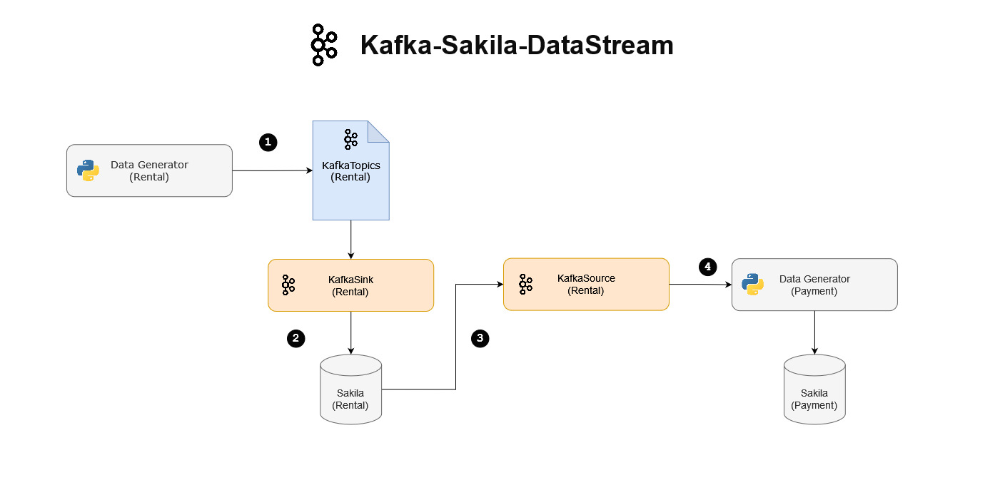

# Kafka-Sakila-DataStream
Simple personal project that use [Apache Kafka](https://kafka.apache.org/) and several other tools for streaming data into MySQL (Sakila Table).

## Project Overview
This project is a data-stream simulation. The main objectives is to generate dummy data and stream the data into MySQL database using Apache Kafka. The database used for this project is [Sakila Database](https://dev.mysql.com/doc/sakila/en/) and the tables are:
<details><summary><b>Rental</b></summary>
The rental table records informations about rented movies such as what movie was rented, who rented the movie, when it was rented, and when it was/will be returned. Here is the table description:

``` SQL
+--------------+--------------------+------+-----+-------------------+-----------------------------------------------+
| Field        | Type               | Null | Key | Default           | Extra                                         |
+--------------+--------------------+------+-----+-------------------+-----------------------------------------------+
| rental_id    | int                | NO   | PRI | NULL              | auto_increment                                |
| rental_date  | datetime           | NO   | MUL | NULL              |                                               |
| inventory_id | mediumint unsigned | NO   | MUL | NULL              |                                               |
| customer_id  | smallint unsigned  | NO   | MUL | NULL              |                                               |
| return_date  | datetime           | YES  |     | NULL              |                                               |
| staff_id     | tinyint unsigned   | NO   | MUL | NULL              |                                               |
| last_update  | timestamp          | NO   |     | CURRENT_TIMESTAMP | DEFAULT_GENERATED on update CURRENT_TIMESTAMP |
+--------------+--------------------+------+-----+-------------------+-----------------------------------------------+
```
</details>
<details><summary><b>Payment</b></summary>

The payment table records payment made by a customer after they rented a movie. Here is the table structure:

``` SQL
+--------------+-------------------+------+-----+-------------------+-----------------------------------------------+
| Field        | Type              | Null | Key | Default           | Extra                                         |
+--------------+-------------------+------+-----+-------------------+-----------------------------------------------+
| payment_id   | smallint unsigned | NO   | PRI | NULL              | auto_increment                                |
| customer_id  | smallint unsigned | NO   | MUL | NULL              |                                               |
| staff_id     | tinyint unsigned  | NO   | MUL | NULL              |                                               |
| rental_id    | int               | YES  | MUL | NULL              |                                               |
| amount       | decimal(5,2)      | NO   |     | NULL              |                                               |
| payment_date | datetime          | NO   |     | NULL              |                                               |
| last_update  | timestamp         | YES  |     | CURRENT_TIMESTAMP | DEFAULT_GENERATED on update CURRENT_TIMESTAMP |
+--------------+-------------------+------+-----+-------------------+-----------------------------------------------+
```
</details>

The project process flow explained as follows:



1. Generate dummy data that we're going to ingest to Rental table using Python script, and produce the dummy data to Kafka Topics (Rental)
2. Get the data from Kafka Topics (Rental) and ingest the data into Rental table using **Kafka JDBC Sink Connector**.
3. Get the ingested data from Rental Table using **Kafka JDBC Source Connector** to generate dummy payment data (The reason we need Rental data to generate payment data is because we need the rental information such as **rental_id**, **customer_id**, and **staff_id** from the rental data to generate payment data).
4. Generate payment data using rental information, and ingest the payment data into Payment table.


## Tools

* [Docker](https://www.docker.com/)

    This project use docker to easily run required tools for this project (Confluent and MySQL).

* [Apache Kafka](https://kafka.apache.org/)

    This project use Kafka as messaging system to create streaming data pipelines.

* [Confluent](https://www.confluent.io/)
    
    For managing Kafka Topics, Kafka Connectors, and Avro Schema

* [Python](https://www.python.org/)

    We use Python to generate dummy messages, produce the dummy data to Kafka Topics, and consume the dummy data from kafka Topics.

## Files, Folders Description
    .
    ├───avro_schema                          # Storing Avro Schema
    ├───images                               # Images for README
    ├───mysql_db                             # MySQL data
    │   ├───data                             # Storing MySQL databases
    │   └───sql                              # Storing MySQL script for initialization
    └───share                                # Kafka Connect data
    |    └───confluent-hub-components        # Storing Kafka Connect plugins and JAR Files
    ├───docker-compose.yml                   # Docker compose file
    ├───mysqlsink.properties                 # Kafka Connect Sink configuration (Import to Confluent) 
    ├───mysqlsource.properties               # Kafka Connect Source configuration (Import to Confluent)
    ├───payment.py                           # Python script for generating payment data
    ├───rental.py                            # Python script for generating rental data
    └───requirements.txt                     # Python library requirements

## How To Use
1. Start **Docker** and run **docker-compose.yml**
2. Open **Confluent** (localhost:9021) in your browser, import **mysqlsink.properties** and **mysqlsource.properties** to **Confluent** > **Kafka Connect**
3. Run **rental.py**
4. Run **payment.py**

## Notes
1. For MySQL initialization, **docker-compose.yml** use Docker Entrypoint to run SQL script once when MySQL engine start for the first time. Important notes, make sure the **Docker Volume** for MySQL data is empty (**./mysql_db/data** must be empty before running the **docker-compose.yml**).
2. You can try another **kafka Sink and Source connector** by downloading your data systems connector at [Confluent Hub](https://www.confluent.io/hub/), place the file to **./share/confluent-hub-components/**
